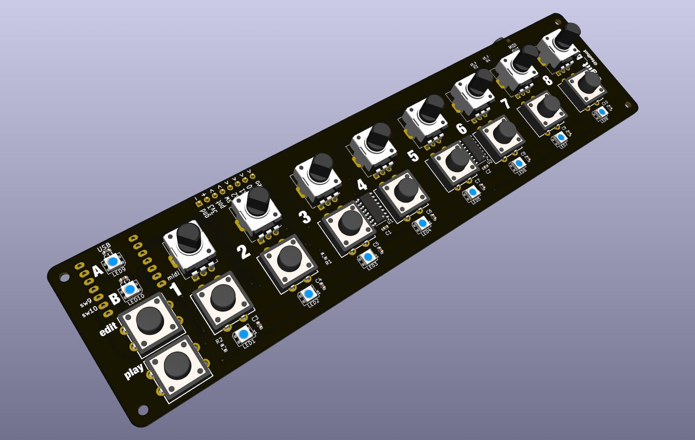
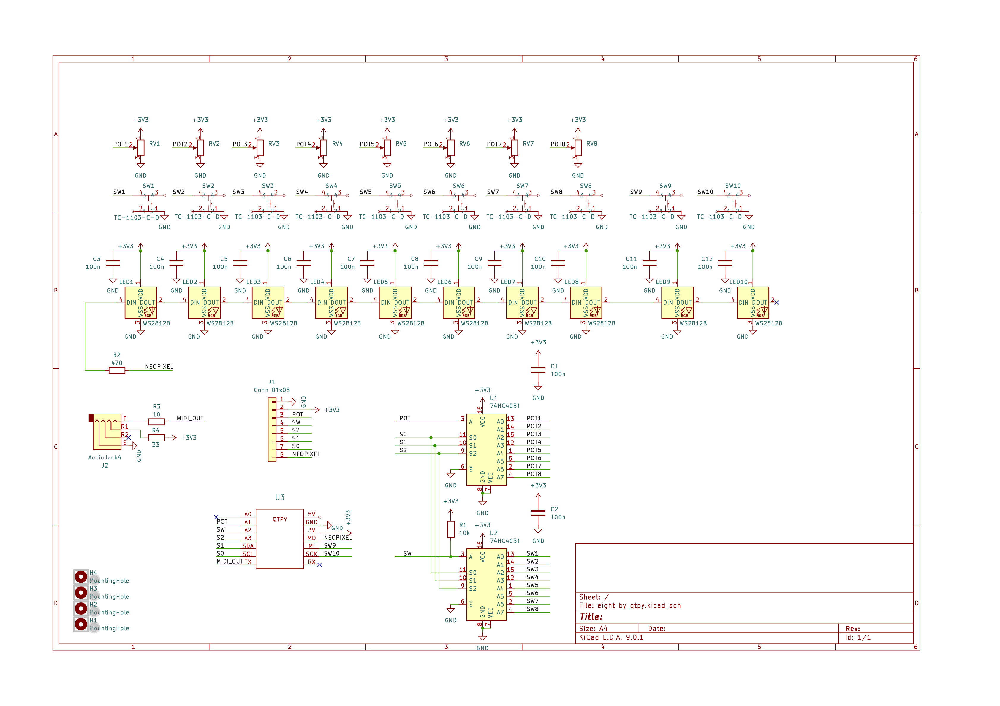

# eight_by

An 8-knob + 8 buttons + eight RGB LEDs board, 
all controllable with only 8 pins

Pot options:

- 9mm Song Hui trimmer pots B10K - [synthcube](https://synthcube.com/cart/parts/potentiometers-and-trimpots/song-huei-9mm-panel-trim-pot-short)
- Just about any other 9mm pot

Buttons are: 
- 12mm tact (LCSC C561260)
